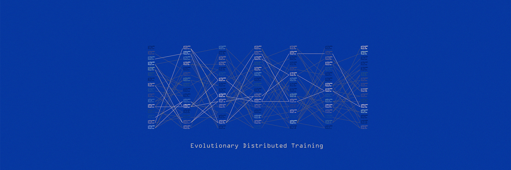

# Evolutionary Distributed Training

## This repository contains prototypes of Evolutionary Distributed Training (EDT) -- Experimental methods to combine Evolutionary Algorithms (EA) with Distributed Deep Learning.

### How to use:
The `EDT_LM` folder contains the EDT method for language model pretraining. See `README.md` in that folder for further instructions.

The `EDT_RL` folder contains the EDT method for self-player reinforcement learning. See `README.md` in that folder for further instructions.

The `EDT_EVOMERGE` folder contains the EDT method for LLM post-training. See `README.md` in that folder for further instructions.
